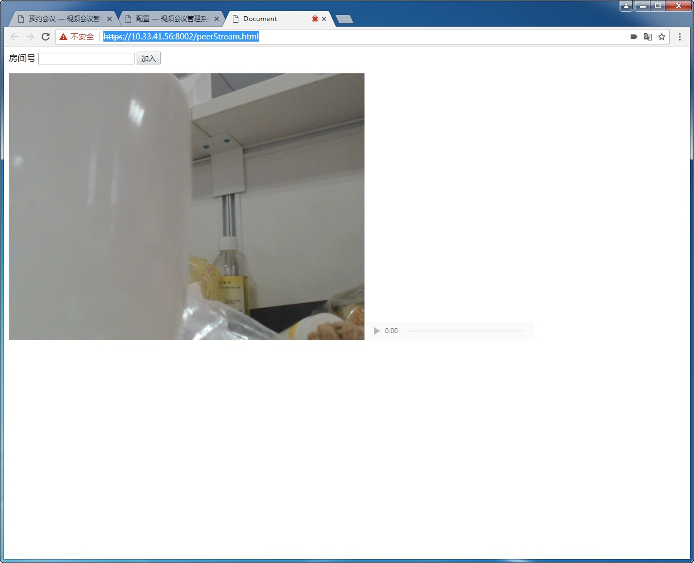
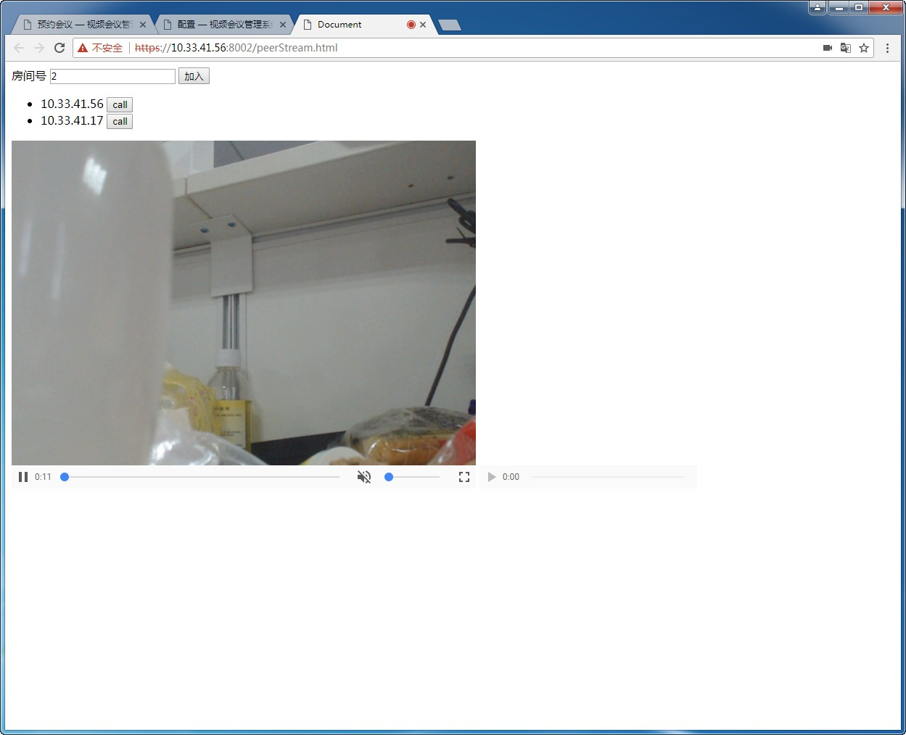
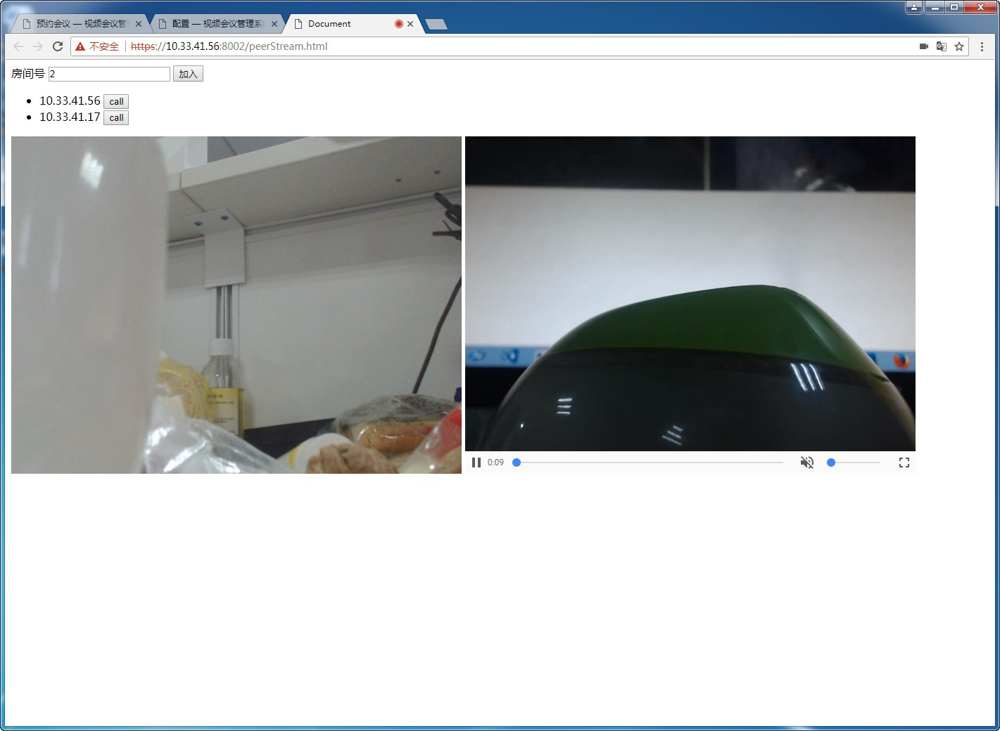

# webRTC p2p 简单例子
> 例子中的语法不够简洁、功能不够完善，此例仅供学习网页之间webRTC实现**音视频通讯流程以及相关api调**

## 如何调用
```js
cd 当前目录
node mediaStream/server

命令行输出
Server started on port 8002
open 'https://10.33.41.56:8002/peerStream.html'
```
打开输出的页面，允许获取本地设备之后看到如下情况



找两台有摄像头的电脑打开这个页面，并加入同一房间



call另一个ip

